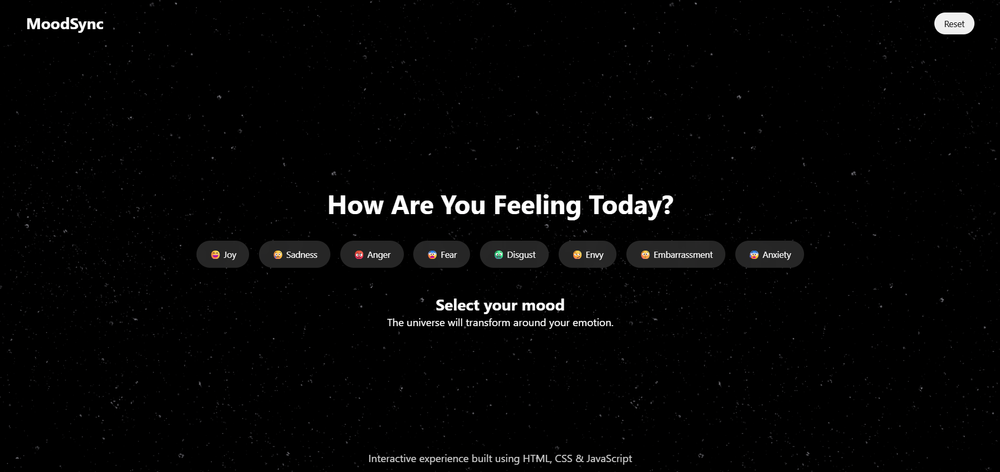
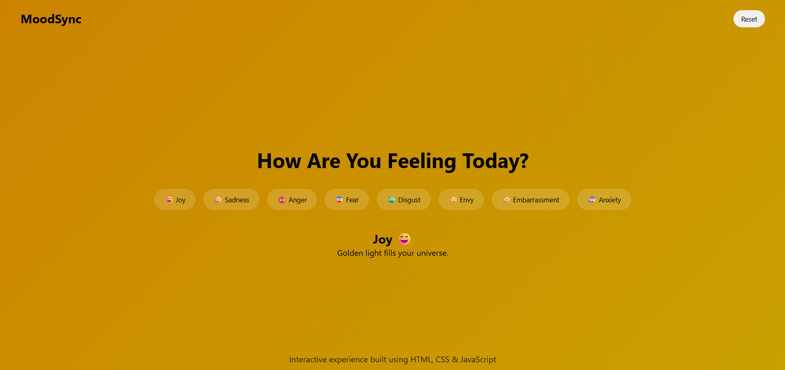
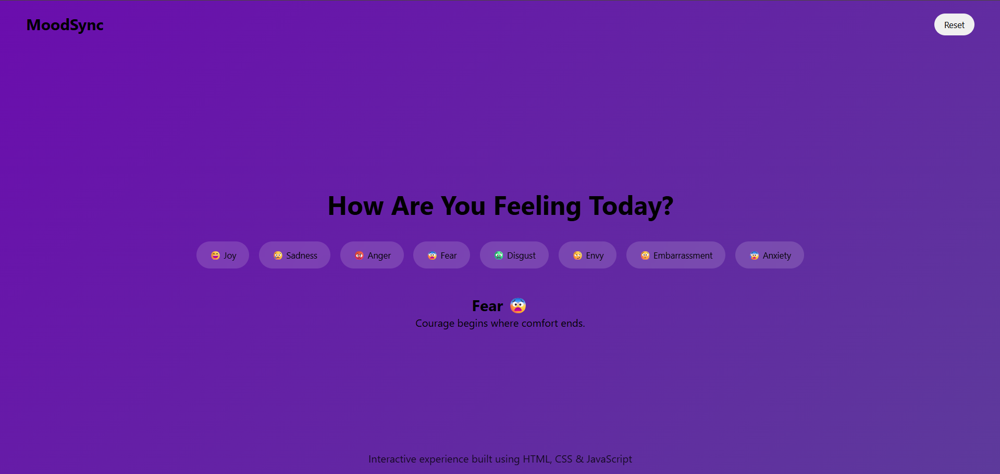

# moodsync-369
This is an interactive emotion-based website that represents different human feelings through smooth animations and expressive quotes. Each emotion had subtle motion effects, creating an engaging and relatable user experience.
## 📸 Screenshots

### 🏠 Home Page

### 😊 Emotions View 1

### 🌟 Emotions View 2

For reference added the website link: https://moodsync-369.vercel.app/
